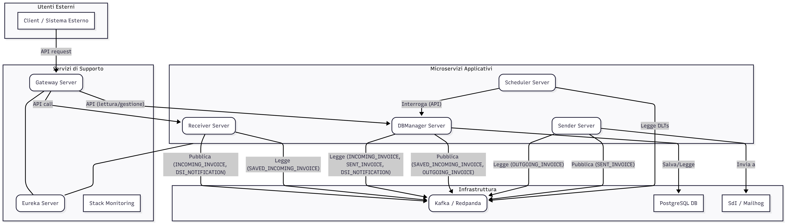
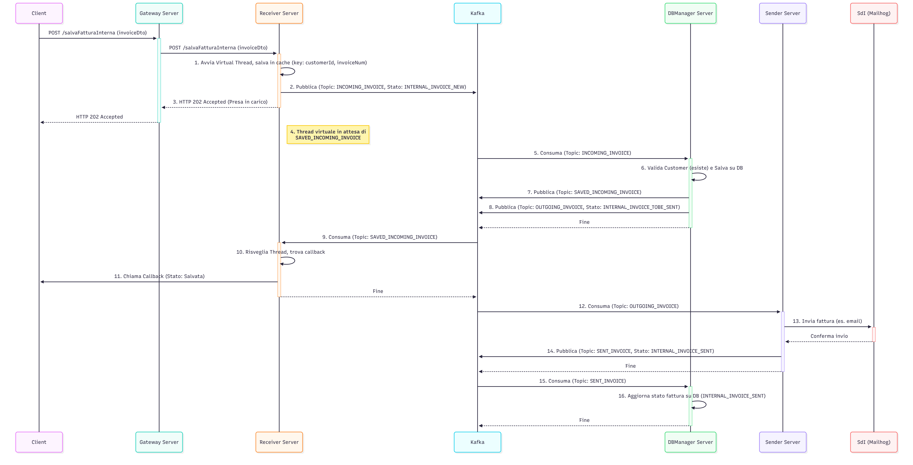
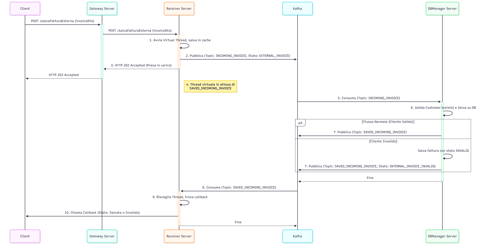
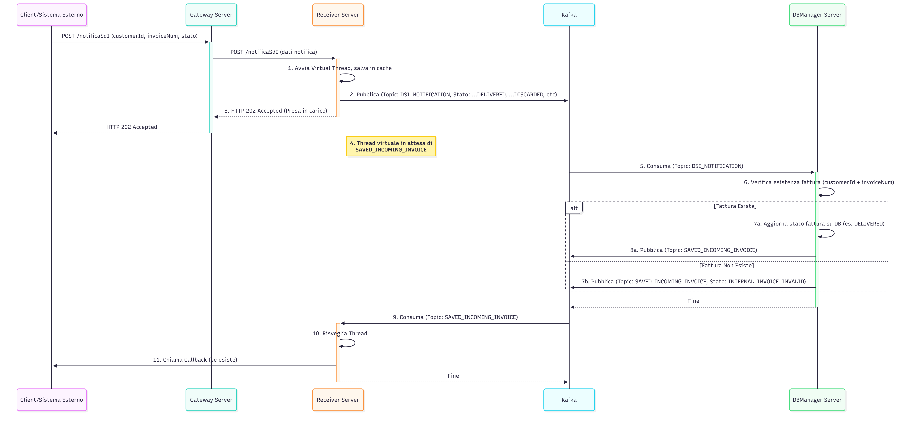

# Scenario

Progetta e implementa una soluzione a **microservizi** per la gestione di un flusso di Fatturazione Elettronica.
Riferimento al documento dei requisiti: [prova-tecnica.md](prova-tecnica.md)

## Architettura:

## Sequence Diagram

### Inserimento fattura interna
Si suppone l'utente sia loggato e abbia compilato la fattura attraverso un'interfaccia apposita.
L'utente è presente nel sistema.

### Inserimento fattura esterna
Si suppone il sistema che invia la fattura per il cliente aruba
conosca il customer_id dell'utente

### SdI notifica il risultato della spedizione della fattura
Si suppone venga mandato customer id, invoice number e stato

### RECEIVER SERVER
Riceve fatture nuove e accende un thread virtuale per la gestione.
Ha una propria cache per associare customer, fattura a callback di risposta per mantenere il meccanismo asincrono.
Si occupa di creare un thread virtuale per l'invio a DBMANAGER usando la coda kafka incomingInvoice o SDI_NOTIFICATION.
Il thread attende che la medesima fattura arrivi sulla coda savedInvoice per chiudere il giro e chiamare la callback
notificando lo stato della fattura, che potrebbe anche essere INVALID_INVOICE.
In caso non riesca a salvare dopo un certo numero di tentativi, la fattura finisce in DLT.
In caso non riesca a chiamare la callback dopo un certo numero di tentativi, la fattura finisce in DLT.

##### FLUSSO di lavoro
Il servizio di ricezione ha 3 endpoint:

salvaFatturaInterna ->

    * Necessita dei seguenti dati in ingresso: invoiceDto (contiene anche customerId e callback per la risposta)
    * Avvia un virtual thread che, per ogni fattura in ingresso:
    * Salva su cache locale customerId, invoiceNumber e riferimento a thread virtuale.  
    * Mette fattura in stato INTERNAL_INVOICE_NEW
    * Invia a kafka su topic incomingInvoice
    * Viene risvegliato da receiver kafka quando la corrispondente fattura arriva su savedInvoice
    * Ha un timeout oltre il quale manda la fattura in dlt
    * Invia la risposta chiamando la callback
    * Ha un timeout oltre il quale manda la fattura in dlt

salvaFatturaEsterna ->

    * Necessita dei seguenti dati in ingresso: invoiceDto (contiene anche customerId e callback per la risposta)
    * Avvia un virtual thread che, per ogni fattura in ingresso:
    * Salva su cache locale customerId, invoiceNumber e riferimento a thread virtuale.  
    * Mette fattura in stato EXTERNAL_INVOICE
    * Invia a kafka su topic incomingInvoice
    * Viene risvegliato da receiver kafka quando la corrispondente fattura arriva su savedInvoice
    * Invia la risposta chiamando la callback
    * Ha un timeout oltre il quale manda la fattura in dlt

notificaSdI ->

    * Necessita dei seguenti dati in ingresso: customerId, invoiceNumber, stato
    * Avvia un virtual thread che, per ogni notifica in ingresso:
    * Salva su cache locale customerId, invoiceNumber e riferimento a thread virtuale.  
    * Mette fattura in stato INTERNAL_INVOICE_DELIVERED, INTERNAL_INVOICE_DISCARDED o INTERNAL_INVOICE_NOT_DELIVERED
    * Invia a kafka su topic dsiNotification
    * Viene risvegliato da receiver kafka quando la corrispondente fattura arriva su savedInvoice
    * Invia la risposta chiamando la callback se esiste.
    * Ha un timeout oltre il quale manda il dato in dlt

### DBMANAGER SERVER
Dedicato allo storage delle fatture e dei clienti.
La validazione supponiamo sia la verifica dell'esistenza del customer passato.
Dopo la validazione ci sarebbe la firma, che potrebbe essere svolta da un microservizio diverso.

Accesso a REST per la ricerca di clienti e fatture e per la cancellazione di fatture e customers: 
per uso statistico e consultazione e gestione manuale.
Accesso comandato da kafka per creazione/update/cancellazione di fatture e customers.
Legge da incomingInvoice le fatture in entrata, scrive su savedInvoice le fatture in entrata salvate e 
scrive su outgoingInvoice le fatture valide e da spedire a SdI.
Legge da sentInvoice per fare update della fattura in caso di successo o errore. 
Legger da dsiNotification per le ricevute delle fatture inviate a SdI e scrive su savedInvoice il risultato del salvataggio
Se non riesce a comunicare su sistemi esterni dopo un certo numero di tentativi, il dato va il DLT per gestione successiva

#### FLUSSO di lavoro
Il DbManager riceve su incomingInvoice e su dsiNotification:

    * Riceve su incomingInvoice
    * Avvia un thread per ogni fattura in ingresso
    * Verifica se customerId esiste 
    * Se si salva la fattura e scrive su savedInvoice e su outgoingInvoice con stato INTERNAL_INVOICE_TOBE_SENT
        ** Attende una risposta su sentInvoice per aggiornare lo stato a INTERNAL_INVOICE_SENT o INTERNAL_INVOICE_NOT_SENT 
    * Se no salva la fattura e scrive su savedInvoice con stato INTERNAL_INVOICE_INVALID
    * Il thread ha un timeout per mandare in DLT la fattura se non riesce a comunicare con qualche sistema esterno

    * Riceve su dsiNotification
    * Avvia un thread per ogni fattura in ingresso
    * Verifica se customerId e invoiceNumber esistono
    * Se si carica cambia lo stato della fattura in INTERNAL_INVOICE_DELIVERED, INTERNAL_INVOICE_DISCARDED o INTERNAL_INVOICE_NOT_DELIVERED e scrive su savedInvoice  
    * Se no scrive su savedInvoice con stato INTERNAL_INVOICE_INVALID 
    * Il thread ha un timeout per mandare in DLT la notifica ricevuta se non riesce a comunicare con qualche sistema esterno

### SENDER SERVER
Legge da kafka outgoingInvoice per mandare a SdI e scrive su sentInvoice il risultato della spedizione.
Se dopo un certo numero di tentativi non riesce a comunicare ad altri sistemi il risultato della propria operazione,
il dato va nella DLT per gestione successiva.
Supponiamo che l'invio a SdI sia via email, server e porta configurabili

### SCHEDULER SERVER
Ha un job che gira ogni x minuti configurabili per la lettura delle DLT di tutti i microservizi 
ed eventuale notifica dell'esistenza di problemi scrivendo un report che viene salvato come csv 
in una cartella configurata
Ha un job che gira ogni x minuti configurabili che interroga il dbmanagre per creare un semplice csv con:
stato fattura, numero fattura, username customer, email customer, data creazione e chi ha creato, 
data update e chi ha fatto update. Il file viene salvato in apposita cartella anch'essa configurabile  

### CONFIGURATION SERVER
Per la gestione di configurazioni specifiche per l'ambiente

### EUREKA SERVER
Per il discovery dei servizi

### GATEWAY SERVER
Punto di autenticazione/autorizzazione e ingresso dall'esterno
    Ho simulato l'uso di un token da sostituire con integrazione a keycloak 
    csrf disabilitato per via del token (il cross origin è bene controllarlo in caso si usino cookies per le sessioni)
    Nel codice c'è il metodo per integrare keycloak.

### Gestione resilienza
    Qualsiasi microservizio ha il seguente meccanismo di gestione errori:
        Solo il gateway ha un fallback controller per richieste che vanno in timeout
        Rate limiter pe evitare che con una singola sessione si possa evitare denial of service
        CircuitBreaker per la gestione di problemi di connessione ad altri servizi
        Retry con backoff (resilience4j)
        Rate limiter su operazioni onerose (configurato ma non usato nella  prova)
        Per quanto riguarda le iterazioni su kafka si usa un retry con backoff prima di mandare in una DLT il dato.
        Kafka è stato configurato affinchè i microservizi si riallineino quando tornato attivi, andando a consumare quanto non gestito
        E' stato usato inoltre il SAGA pattern coreografato
### Gestione scalabilità
    E' stato usato eureka per la registrazione delle istanze di microservizio 
    e un gateway per load balancing. 
    I servizi sono dockerizzati, mancano solo i file kubernetis 
    per il dimensionamento dei POD e per la quantità di istanze minime e massime.

    
---
## Comandi utili

#### Creazione DB
In folder docker-compose:
docker compose up  postgres -d
#### Creazione configuration server
In folder docker-compose:
docker compose up  xxx -d
#### Creazione eurekaserver
In folder docker-compose:
docker compose up  eurekaserver -d
#### Creazione kafka
In folder docker-compose:
docker compose up  kafka -d

#### Compilazione immagine docker
mvn compile jib:dockerBuild

#### Invio a repository docker
mvn jib:build

### SVILUPPO con servizi a supporto su docker e microservizi in locale 
Entrare nel folder docker-compose/default e lanciare:
docker compose up --build -d --force-recreate
verranno lanciati: kafka kafka-ui postgres gateway backend grafana tempo prometheus minio alloy mailhog redis

Per fermare tutto:
docker compose down

### SVILUPPO con servizi a supporto su docker e microservizi in docker
Entrare nel folder docker-compose/docker e lanciare:
docker compose up --build -d --force-recreate

Per fermare tutto:
docker compose down

#### microservizi
docker compose up eurekaserver dbmanager receiver sender gatewayserver  --build -d --force-recreate

docker compose down eurekaserver dbmanager receiver sender gatewayserver

#### Accesso a mail server client
http://localhost:8025/ per visualizzare le spedizioni effettuate

#### Accesso alla documentazione swagger
http://localhost:9020/swagger-ui/ o più in generale http://localhost:XXXX/swagger-ui/
Porte dei microservizi:
eurekaserver: 8761
receiver: 8080
dbmanager: 9020
sender: 9010
scheduler: 9030
gatewayserver: 8072

#### Kafka-ui
http://localhost:9094/

### Test con gatling
Questo comando compilerà ed eseguirà tutte le simulazioni Gatling
che trova nel tuo progetto in src/test/scala.

    mvn gatling:test

Se vuoi eseguire una simulazione specifica, puoi usare l'opzione 

    * da docker
    mvn gatling:test -D"gatling.simulationClass=com.experis.receiver.load.GWReceiverLoadExternalInvoiceTest1"
    mvn gatling:test -D"gatling.simulationClass=com.experis.receiver.load.GWReceiverLoadInternalInvoiceTest1"
    mvn gatling:test -D"gatling.simulationClass=com.experis.receiver.load.GWReceiverLoadSdiNotificationsTest1"
    mvn gatling:test -D"gatling.simulationClass=com.experis.receiver.load.GWReceiverLoadExternalInvoiceTest"
    mvn gatling:test -D"gatling.simulationClass=com.experis.receiver.load.GWReceiverLoadInternalInvoiceTest"
    mvn gatling:test -D"gatling.simulationClass=com.experis.receiver.load.GWReceiverLoadSdiNotificationsTest"
    
    * da local
    mvn gatling:test -D"gatling.simulationClass=com.experis.receiver.load.ReceiverLoadExternalInvoiceTest1"
    mvn gatling:test -D"gatling.simulationClass=com.experis.receiver.load.ReceiverLoadInternalInvoiceTest1"
    mvn gatling:test -D"gatling.simulationClass=com.experis.receiver.load.ReceiverLoadSdiNotificationsTest1"
    mvn gatling:test -D"gatling.simulationClass=com.experis.receiver.load.ReceiverLoadExternalInvoiceTest"
    mvn gatling:test -D"gatling.simulationClass=com.experis.receiver.load.ReceiverLoadInternalInvoiceTest"
    mvn gatling:test -D"gatling.simulationClass=com.experis.receiver.load.ReceiverLoadSdiNotificationsTest"

